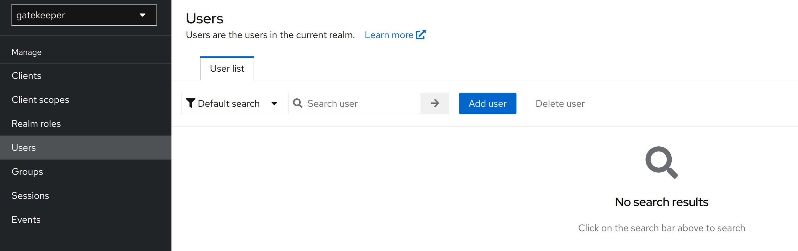
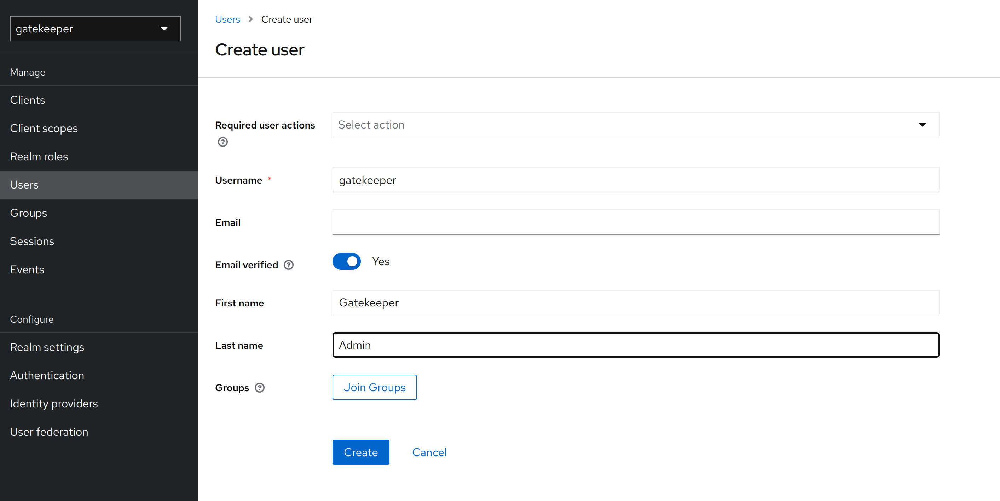
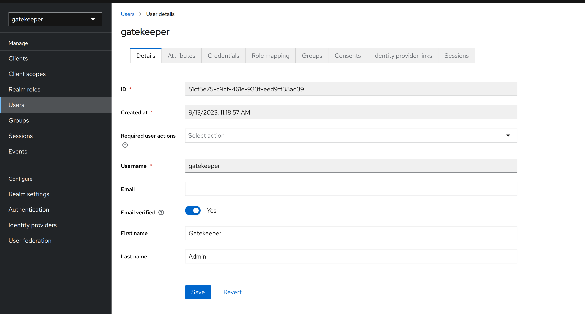
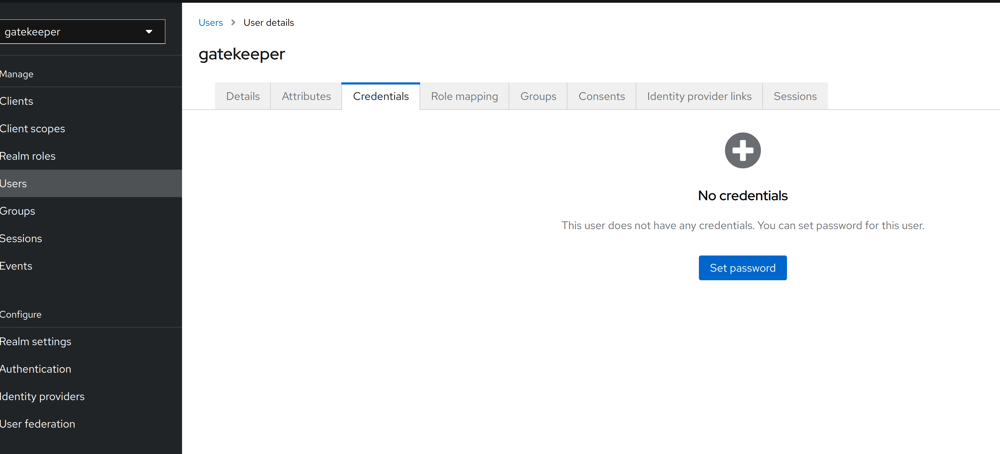
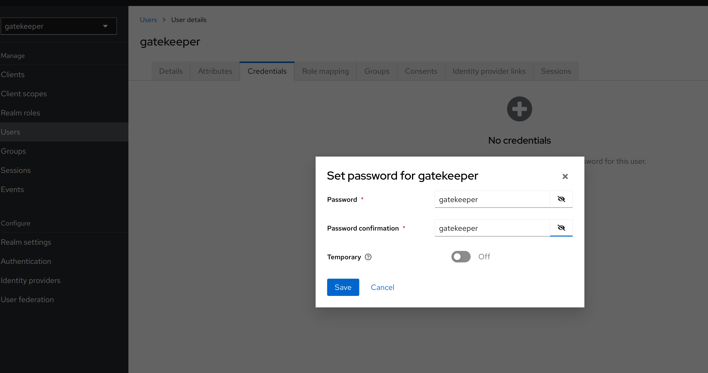
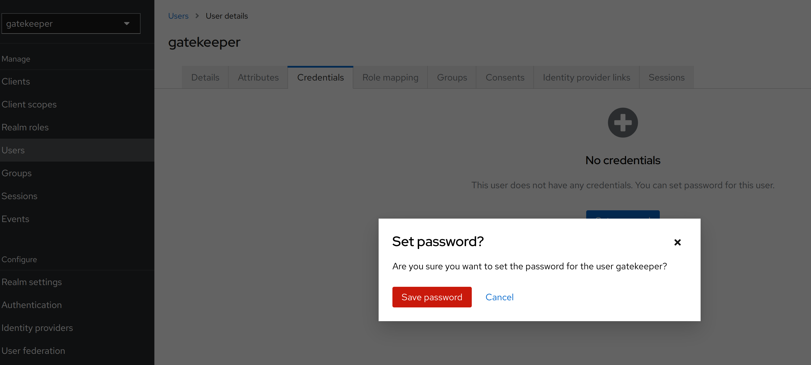

# Create Keycloak User

Url:
* [http://localhost:8080/admin/](http://localhost:8080/admin/) - Admin Console

1. Login to Keycloak admin console and create a user with the following credentials:
* Username: `admin`
* Password: `admin`

2. Select the `gatekeeper`
3. Create a new user following the steps below:
   1. 
   
   3. 
   Remember to set the `Email Verified` to `On`
   
   3. 
   4. 
   5. 
   Remember to set the `Temporary` to `Off`
   
   6. 